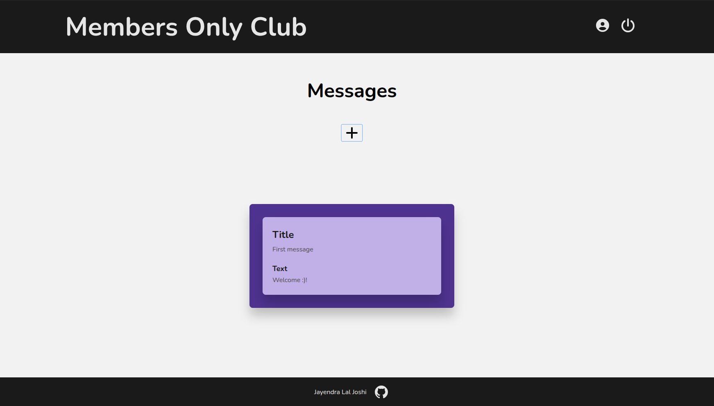
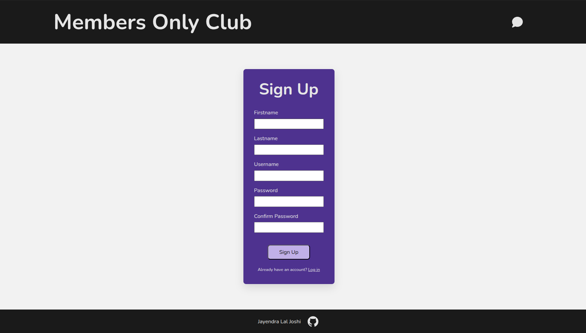
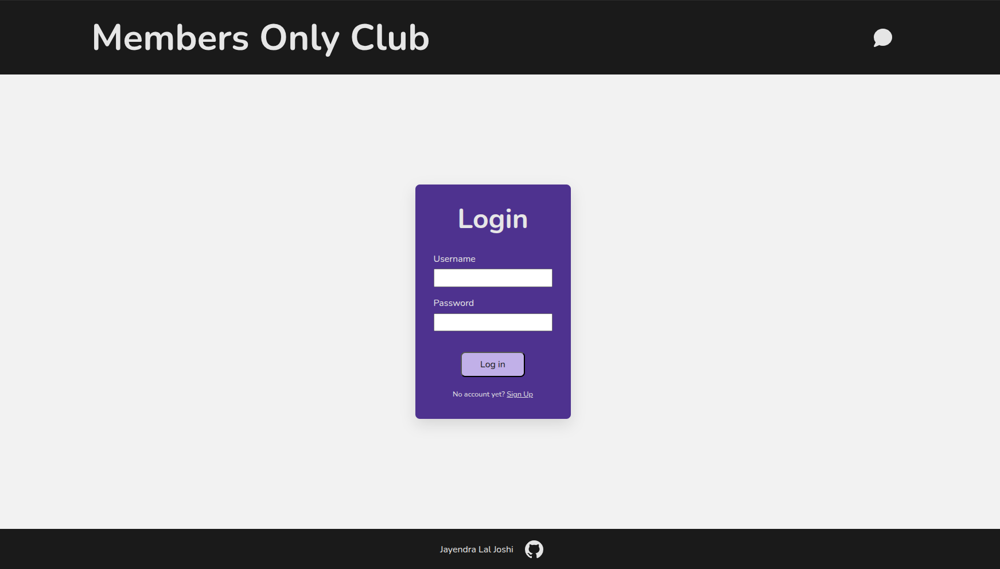
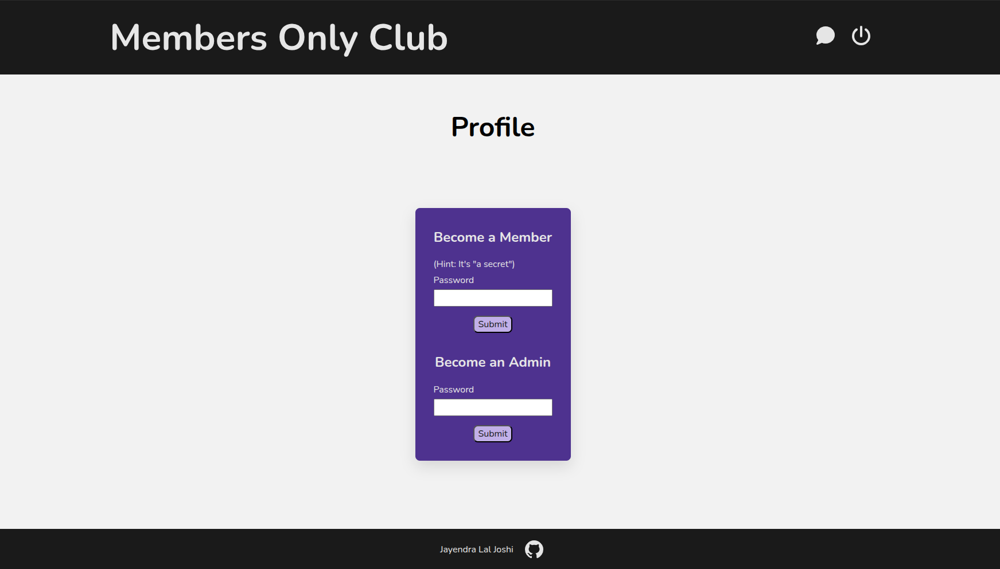

# Members-Only

A responsive web application where users can create an account, log in, and view messages on a global message board. Users can upgrade their accounts to member or administrator status by entering the appropriate password on their profile page.

Members can create messages and view each message’s author and timestamp. Administrators have all member permissions and can also delete messages.

## About This Project

This project was built as part of [The Odin Project](https://www.theodinproject.com/lessons/node-path-nodejs-members-only) Node.js curriculum.

## What I Learned

Through this project, I learned how to securely store user credentials in a PostgreSQL database by hashing passwords before saving them. I also learned how to implement authentication and manage sessions with Passport.js and express-session, allowing users to remain logged in as they navigate between pages.

I gained experience using the Express session object to persist user-specific data across requests within the same session. I used this data in conditional statements to control authorization and conditionally render content in EJS templates based on a user’s authentication status and access level.

This project also strengthened my understanding of input validation and error handling. I handled expected errors within the controller methods and provided users with clear, helpful feedback when an operation failed. In addition, I created custom unauthorized and server-error pages, along with centralized error-handling middleware for unexpected application errors.

## Technologies and Tools Used

- HTML5
- CSS3
- JavaScript (ES6+)
- ESLint
- Git
- GitHub
- Font Awesome
- Node.js
- Express
- EJS
- PostgreSQL
- pg
- dotenv
- express-validator
- express-session
- Passport.js
- SonarQube

## Getting Started

1. Clone the repository.

2. Install the dependencies:
   - `npm install`

3. Create a PostgreSQL database alongside 'users' and 'messages' tables.

4. Set the following environment variables:
   - `DATABASE_URL`
   - `SESSION_SECRET`
   - `MEMBER_PASSWORD`
   - `ADMIN_PASSWORD`

5. Start the development server:
   - `npm run dev`

## Live Demo

- Railway: https://members-only-production-7c1e.up.railway.app/

## Screenshots

## Resources

### Icons

- [Power Off icon](https://fontawesome.com/icons/classic/solid/power-off)
- [GitHub icon](https://fontawesome.com/icons/brands/solid/github)
- [Plus icon](https://fontawesome.com/icons/classic/solid/plus)
- [Login icon](https://fontawesome.com/icons/classic/solid/right-to-bracket)
- [Profile icon](https://fontawesome.com/icons/classic/solid/circle-user)
- [Messages icon](https://fontawesome.com/icons/classic/solid/comment)
